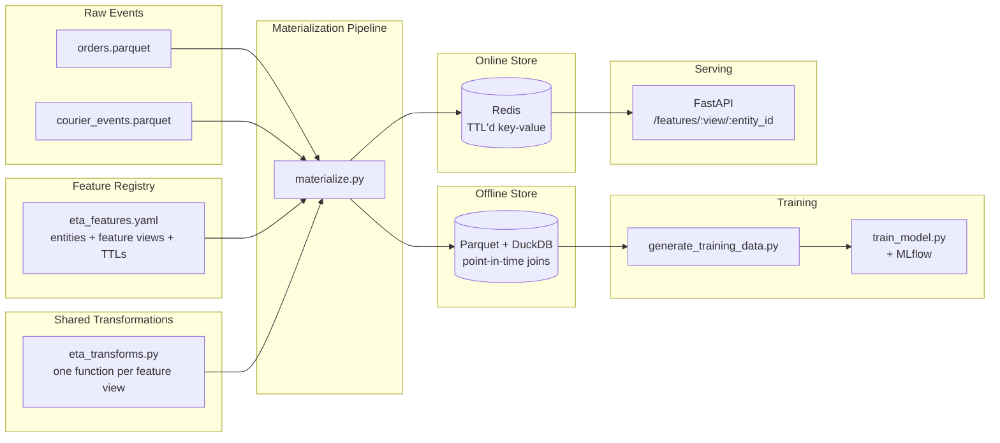

# ML Feature Store — ETA Prediction

A lightweight, from-scratch feature store built to demonstrate the core problem
every ML platform team has to solve: **making sure the feature values a model
was trained on are the same values it sees at serving time.**

Built around a DoorDash-style use case: predicting delivery ETA from
restaurant prep-time and courier performance features.

## Why build this instead of just using Feast?

Feast (and similar frameworks) solve this problem well, but their internals are
opaque in an afternoon read. This repo intentionally implements the same core
mechanics — a versioned registry, an offline store with point-in-time-correct
joins, an online store for low-latency serving, and shared transformation code
— in ~500 lines of readable Python, so the *mechanism* is the focus rather than
a framework's API surface.

## Architecture



**The key design point:** `materialize.py` computes each feature exactly once
per run, using the transformation function registered for that feature view,
then writes the *same* output to both stores. There's no separate "online
feature logic" — so offline/online skew isn't something you have to test for
after the fact, it's structurally prevented.

## What's inside

| Path | Purpose |
|---|---|
| `feature_store/definitions/eta_features.yaml` | Declares entities, feature views, dtypes, owners, TTLs |
| `feature_store/registry/registry.py` | Loads definitions, computes a version hash per feature view |
| `feature_store/transformations/eta_transforms.py` | Pure functions: raw events → features, shared by batch and (future) streaming paths |
| `feature_store/offline_store/offline_store.py` | Parquet + DuckDB `ASOF JOIN` for point-in-time-correct historical retrieval |
| `feature_store/online_store/online_store.py` | Redis-backed low-latency store, with TTLs and an online-only live counter example |
| `pipelines/materialize.py` | Batch job: raw data → transform → offline + online stores |
| `pipelines/generate_training_data.py` | Builds a leakage-free training set via point-in-time joins |
| `pipelines/train_model.py` | Trains a GradientBoosting ETA model, logs to MLflow |
| `api/main.py` | FastAPI serving layer over the online store |
| `tests/test_consistency.py` | Proves offline/online value parity + no future-data leakage |

## Quick start

```bash
python -m venv .venv && source .venv/bin/activate
pip install -r requirements.txt

# 1. Start Redis (and optionally MLflow) locally
docker compose -f docker/docker-compose.yml up -d redis mlflow

# 2. Generate synthetic order/courier event data
python pipelines/generate_synthetic_data.py

# 3. Materialize features to both offline (Parquet) and online (Redis) stores
python pipelines/materialize.py

# 4. Build a point-in-time-correct training dataset
python pipelines/generate_training_data.py

# 5. Train the ETA model (logged to MLflow)
python pipelines/train_model.py

# 6. Serve features over HTTP
uvicorn api.main:app --reload --port 8000
# curl http://localhost:8000/features/restaurant_prep_time_features/r_003

# 7. Run the consistency test suite
pytest tests/ -v
```

## Notable design decisions

- **Point-in-time correctness first.** `offline_store.point_in_time_join` uses
  DuckDB's `ASOF JOIN` so training data never contains features computed after
  the label's timestamp — a common and hard-to-spot source of inflated offline
  model accuracy that doesn't hold up in production.
- **One transformation, two destinations.** Every feature view maps to exactly
  one Python function. `materialize.py` calls it once and writes the result to
  both stores, so there's no second implementation to drift out of sync.
- **TTLs are a first-class registry property**, not an afterthought — each
  feature view declares its own online TTL, so slow-changing features
  (restaurant prep time) and fast-changing ones (courier acceptance rate) don't
  share a one-size-fits-all expiry.
- **Online-only features are explicit.** `active_deliveries` has no offline
  equivalent — it's a live counter — and the registry/API make that distinction
  visible instead of pretending every feature is symmetric across both stores.

## Possible extensions

- Swap the synthetic data generator for a real Kafka consumer to materialize
  `active_deliveries` from a live event stream instead of manual API calls.
- Add a feature freshness/SLA monitor (Datadog/Prometheus) that alerts when a
  feature view's online TTL expires without a fresh materialization run.
- Extend the registry to detect and reject dtype/schema changes between runs
  using the existing `version_hash`.
